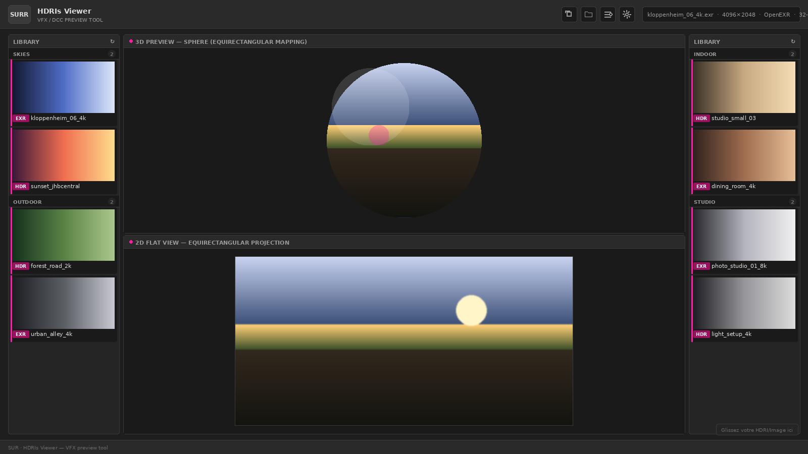

# SURR · HDRIs Viewer

Un viewer HDRI web pour workflows VFX. Charge des fichiers `.hdr`, `.exr`,
`.tiff`, `.dpx`, `.jpg`, `.png` et les prévisualise en 3D (sphère
équirectangulaire) + en 2D (projection plate).

🎨 **Thème DCC dark mode** · 🚀 **Three.js + WebGL** · 📦 **Zéro install
pour la communauté** · 🔗 [www.surrendr.art](https://www.surrendr.art)



---

## ✨ Fonctionnalités

- **Viewport 3D** : sphère matte (sans reflet) avec mapping équirectangulaire
- **Viewer 2D** : projection plate 2:1 sous le viewport
- **OrbitControls** : rotation / zoom / pan style Maya/Blender/Houdini
- **Multi-loaders VFX** : HDR (RGBELoader), EXR (EXRLoader), TIFF (UTIF),
  DPX (parser custom 10-bit RGB), JPG/PNG/WebP/BMP
- **Drag & drop** universel
- **Library latérale** auto-scannée avec thumbnails et catégories
  (skies / outdoor / indoor / studio)
- **Copy path / Open folder** d'un click pour les workflows DCC
- **Generate thumbnails** côté navigateur (zéro dépendance externe)
- **Memory management** : dispose automatique des textures 8K float

---

## 🚀 Démarrer en 30 secondes

Il y a **deux façons** d'utiliser le viewer. Choisis selon ton besoin.

### 🌐 Mode WEB (recommandé pour découvrir)

Le viewer est déployé en ligne — rien à installer.

👉 [Ouvrir le viewer] https://surrendrart-hub.github.io/surr-hdris-viewer/

Glisse-dépose tes propres fichiers `.hdr` / `.exr` / `.tiff` / `.dpx` /
`.jpg` / `.png` directement dans la page. La library latérale affichera
les fichiers de démo du repo.

### 💻 Mode LOCAL (pour usage VFX sérieux)

Tu veux ta propre library persistante avec tes HDRIs, et copier les
chemins absolus pour les coller dans Nuke / Maya / Houdini.

1. **Clone le repo** :
   ```bash
   git clone https://github.com/<ton-user>/surr-hdris-viewer.git
   cd "surr-hdris-viewer"
   ```

2. **Lance le serveur local** (double-clic sur Windows) :
   - **Windows** : double-clic `start-server.bat`
   - **macOS / Linux** : `./start-server.sh` (rendre exécutable au préalable : `chmod +x start-server.sh`)

   Le script essaie automatiquement Python, puis Node.js comme fallback.

3. **Le navigateur s'ouvre** sur `http://localhost:8000`

4. **Dépose tes HDRIs** dans `assets/skies/`, `assets/outdoor/`,
   `assets/indoor/` ou `assets/studio/`

5. **Clique sur 🛠 dans le header** → sélectionne le dossier `assets/`
   → tous les thumbnails JPEG et le `manifest.json` sont générés
   automatiquement (utilise la **File System Access API** de ton
   navigateur, **pas besoin d'ImageMagick**)

---

## 📦 Dépendances optionnelles

Aucune dépendance n'est *obligatoire* pour utiliser le viewer.

| Outil | Pour quoi ? | Alternative incluse |
|-------|-------------|---------------------|
| Python 3.x | Lancer le serveur HTTP local | Node.js (`npx serve`), miniserve, Caddy, ou simplement le mode WEB |
| Node.js | Lancer le serveur via `npx serve` | Idem |
| ImageMagick | Générer les thumbnails JPEG | ✅ **Bouton "🛠 Build" dans le header — zéro dépendance** |

> **Tip** : Le `.bat` `make-previews.bat` qui utilisait ImageMagick est
> conservé pour les utilisateurs avancés qui préfèrent un workflow en
> ligne de commande, mais ce n'est plus la voie recommandée.

---

## 🌐 Déployer ta propre version web

Pour publier ton viewer sur GitHub Pages avec ta library de HDRIs :

```bash
# 1. Push sur GitHub
git remote add origin https://github.com/<ton-user>/surr-hdris-viewer.git
git branch -M main
git push -u origin main

# 2. Active GitHub Pages :
#    Settings → Pages → Source = "main" branch / "/ (root)"

# 3. (Optionnel) Génère thumbnails + manifest avec le bouton 🛠
#    en local AVANT de push, puis re-push.
```

Ton viewer sera dispo sur `https://<ton-user>.github.io/surr-hdris-viewer/`.

> **Important pour le mode web** : GitHub Pages ne fournit pas de
> directory listing. La library lit le `manifest.json` que tu génères
> avec le bouton 🛠 en local. Sans manifest, les panneaux library
> seront vides en ligne (mais le drag & drop fonctionne toujours).

---

## 📁 Structure du projet

```
surr-hdris-viewer/
├── index.html              # Page principale
├── start-server.bat        # Lanceur Windows (Python ou Node)
├── start-server.sh         # Lanceur macOS/Linux
├── make-previews.bat       # (Optionnel) Génération via ImageMagick
├── config.js               # Auto-généré (gitignored)
├── css/style.css           # Thème DCC dark mode
├── js/
│   ├── main.js             # Bootstrap
│   ├── viewer3D.js         # Scène Three.js (sphère + OrbitControls)
│   ├── viewer2D.js         # Canvas 2D équirectangulaire
│   ├── loaders.js          # Multi-loaders HDR/EXR/TIFF/DPX/PNG/JPG
│   ├── dragdrop.js         # Drag & drop + file picker
│   ├── library.js          # Panneaux latéraux + auto-scan + manifest
│   ├── thumbnails.js       # Génération JS (remplace ImageMagick)
│   ├── pathutils.js        # Copy paths + config Project Root
│   └── toast.js            # Notifications
└── assets/
    ├── skies/              # HDRIs ciel
    │   ├── *.hdr / *.exr   # Fichiers originaux (le viewer charge ceux-là)
    │   ├── *_thumb.jpg     # Thumbnails (générés par 🛠)
    │   └── manifest.json   # Listing pour le mode web (généré par 🛠)
    ├── outdoor/
    ├── indoor/
    └── studio/
```

---

## 📖 Tutoriel détaillé

Voir [`TUTORIAL.md`](./TUTORIAL.md) pour un walkthrough complet :
- Installation pas à pas
- Workflow de génération library
- Déploiement GitHub Pages
- Troubleshooting

---

## 🛠 Tech Stack

- **HTML5 / CSS3 natif** (pas de framework, pas de build step)
- **JavaScript ES6+ modules natifs**
- [Three.js](https://threejs.org/) (CDN, ES modules) — moteur 3D
- [UTIF.js](https://github.com/photopea/UTIF.js) (CDN lazy-load) — décodeur TIFF
- Parser DPX custom (SMPTE 268M)

Aucun `node_modules`, aucun `webpack`, aucun build à faire.

---

## 🤝 Crédits

Créé par [Surrendr Studio](https://www.surrendr.art).

---

## 📝 Licence

MIT — fais-en ce que tu veux. Si tu améliores, n'hésite pas à PR. 🎬
